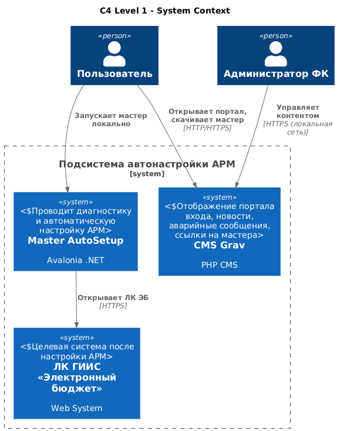
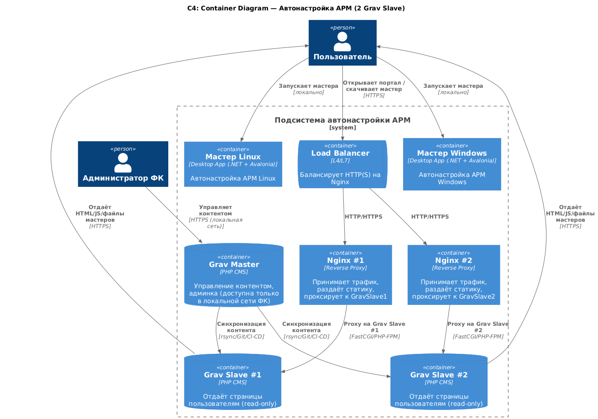
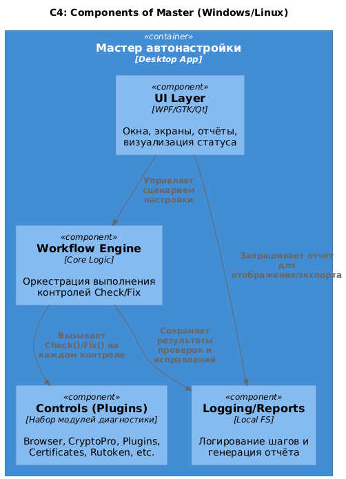

# Архитектура решения по автоматической настройке рабочего места для входа в ГИИС ЭБ

## 1. Исходные требования

На основании трех документов:
- **Чек‑лист проверки ГИИС ЭБ**
- **Краткое руководство по настройке рабочего места для входа в ГИИС ЭБ**
- **Видение работы приложения мастера автоматической настройки рабочего места**

Система должна обеспечить:
- автоматическую диагностику всех компонентов АРМ;
- автоматическую установку/исправление, где возможно;
- помощь пользователю в местах, где требуется ручное участие (личный сертификат, доверенные сайты);
- единый портал входа с блоками «Вход», «Авария», «Помощь», «Новости»;
- два мастера: Windows и Linux;
- локальное хранение отчётов и безопасная работа только на рабочем месте пользователя.

---

## 2. Общая архитектура решения

### 2.1. Компоненты системы

### **1. Веб‑страница «Вход в ЛК и помощь»**
Содержит:
- кнопку «Приступить к работе»;
- блок «Авария» (статус подсистем);
- раздел «Помощь» — кнопки:
    - «Автоматическая настройка» (мастер),
    - «Ручная настройка» (инструкция);
- новостную ленту.

На сервере расположены:
- мастера Windows/Linux,
- инструкция PDF,
- JSON-файлы `status.json` и `news.json`.

---

### **2. Лёгкий backend (опционально)**
REST API:
- `/api/status` — статус подсистем;
- `/api/news` — новости;
- `/api/download/master` — выдача нужного дистрибутива.

Может отсутствовать — тогда всё обслуживается статикой.

---

### **3. Мастер автоматической настройки АРМ — Windows**
Функции:
- запуск от администратора;
- проверка 100% требований чек‑листа;
- автоматическая установка ПО (CryptoPro CSP, плагин, драйверы, сертификаты);
- проверка браузера с ГОСТ TLS;
- проверка конкурирующих клиентов (Континент TLS, Jinn-Client);
- логирование и отчётность;
- вывод инструкций там, где требуется участие пользователя.

---

### **4. Мастер автоматической настройки АРМ — Linux**
Аналог Windows‑версии, с адаптацией:
- установка CryptoPro CSP из пакетов;
- проверка браузеров и их параметров;
- вывод команд для администратора, если невозможна автоматическая установка.

---

### **5. Интеграция мастера с порталом**
В мастер зашиты ссылки:
- ЛК ГИИС ЭБ,
- Проверка доступности портала,
- СОБИ/УЦ ФК для работы с сертификатами.

---

## 3. Внутренняя архитектура мастера

### 3.1. Слои

### **1. UI‑слой**
Экраны:
- стартовый экран,
- экран диагностики с индикаторами (зелёный/красный),
- экраны исправления,
- инструкции,
- экран завершения,
- экран ошибок + кнопка «Сохранить отчёт».

---

### **2. Оркестратор сценария (Workflow Engine)**

Запускает:
```
Check() → Fix() → Log() → NextControl()
```

Управляет итоговым состоянием и выводом рекомендаций.

---

### **3. Модули контролей (Plugins)**

Каждый модуль реализует:
```
IControl {
  string Name;
  CheckResult Check();
  FixResult Fix(CheckResult state);
}
```

Список контролей:

1. **BrowserGostControl**
    - поиск и проверка Yandex Browser / Chromium GOST;
    - проверка включённого ГОСТ TLS;
    - при отсутствии — установка.

2. **CryptoProCspControl**
    - проверка установленной версии и лицензии;
    - установка или обновление.

3. **CryptoProPluginControl**
    - проверка установленного плагина;
    - установка;
    - инструкции по добавлению доверенных сайтов.

4. **CertificatesRootIntermediateControl**
    - проверка наличия корневых и промежуточных сертификатов УЦ ФК;
    - автоматическая установка.

5. **RutokenDriverControl**
    - проверка драйверов;
    - установка при необходимости.

6. **PersonalCertificateControl**
    - проверка личного сертификата;
    - мастер установки сертификата с участием пользователя.

7. **CompetingClientsControl**
    - Континент TLS-клиент, Jinn-Client;
    - рекомендации по отключению.

8. **PortalAvailabilityControl**
    - проверка доступности порталов;
    - вывод ошибок с рекомендациями.

---

### **4. Логирование и отчёты**
- весь процесс логируется;
- отчёт хранится во временной директории;
- по кнопке «Сохранить» выгружается в выбранное место;
- после закрытия мастера временные данные удаляются.

---

## 4. Архитектура веб‑страницы

### **4.1. Вариант без backend**
Nginx раздаёт:
- HTML/CSS/JS,
- файлы мастеров,
- PDF-инструкцию,
- `status.json` и `news.json`.

JavaScript:
- подгружает статус и новости,
- определяет ОС пользователя,
- выдаёт кнопку скачивания нужной версии мастера.

---

### **4.2. Вариант с backend**
Микросервис:
- обновляет статус подсистем автоматически,
- ведёт ленту новостей,
- логирует скачивания мастеров,
- подготавливает страницу под различные среды.

---

## 5. Обоснование архитектуры

### **1. Полное соответствие требованиям**
- покрывает все пункты чек‑листа и инструкции;
- реализует весь сценарий из документа «Видение»;
- обеспечивает автоматизацию максимального числа операций.

### **2. Модульность**
- каждый контроль — отдельный модуль;
- удобно обновлять версии ПО и добавлять новые проверки;
- мастера и портал развиваются независимо.

### **3. Снижение нагрузки на техподдержку**
Мастер самостоятельно:
- ставит ПО,
- исправляет конфигурации,
- показывает отчёт для сисадмина,
- проводит проверку всех обязательных пунктов.

### **4. Безопасность**
- всё выполняется локально;
- личные сертификаты не передаются наружу;
- отчёты создаются только вручную по запросу;
- соблюдены требования по сертифицированным версиям ПО.

### **5. Расширяемость**
Можно добавить:
- новые проверки,
- поддержку других токенов,
- обновления статуса подсистем,
- централизованную анонимную статистику.

---

## 6. Заключительная схема (кратко)

```
Портал (Nginx/Backend)
 ├── web UI
 ├── статус подсистем
 ├── новости
 ├── инструкция.pdf
 └── мастера Win/Linux

Мастер Win/Linux
 ├── UI
 ├── Workflow Engine
 ├── Controls:
 │    ├── BrowserGostControl
 │    ├── CryptoProCspControl
 │    ├── CryptoProPluginControl
 │    ├── CertificatesControl
 │    ├── RutokenDriverControl
 │    ├── PersonalCertificateControl
 │    ├── CompetingClientsControl
 │    └── PortalAvailabilityControl
 └── Logs / Report
```
## 7. Event Flow (последовательность взаимодействий)


## 8. Диаграммы C4

---

### 8.1. C4 Level 1 – System Context



---

### 8.2. C4 Level 2 – Container Diagram



---

### 8.3. C4 Level 3 – Component Diagram (Master)



---

### 8.4. C4 Level 4 – Code Level (Master, Controls)


## 9. Спецификация backend (OpenAPI)

Для backend-сервиса, обслуживающего страницу входа и мастера автонастройки, подготовлена спецификация в формате **OpenAPI 3.0.3**.

Файл спецификации:

- `api/openapi.yaml`

Краткое содержание:

- **Сервера**:
    - `https://eb.example.ru` — Production,
    - `https://eb-test.example.ru` — Test / Staging.

- **Эндпоинты**:
    - `GET /api/status` — агрегированный статус системы и подсистем.
    - `GET /api/news` — лента новостей/уведомлений (limit/offset/since).
    - `GET /api/download/master?os=windows|linux` — скачивание дистрибутива мастера.

## 10. Architectural Decision Records (ADR)

Отдельно ведётся набор ADR (Architectural Decision Records), фиксирующих ключевые архитектурные решения:

- [adr-001](adr/adr-001-delivery-and-form-factor.md)
  **Форм-фактор и способ доставки мастера**  
  (портал + настольное приложение, а не чисто браузерное решение)

- [adr-002](adr/adr-002-plugin-based-controls-and-workflow.md)
  **Плагинная архитектура контролей и WorkflowEngine**  
  (IControl + набор контролей вместо монолитного сценария)

- [adr-003](adr/adr-003-local-execution-and-logging.md)
  **Локальное выполнение мастера и политика логирования**  
  (логика и данные остаются на АРМ, отчёты — только по запросу пользователя)

- [adr-004](adr/adr-004-backend-optional-vs-static-only.md)
  **Опциональный backend vs полностью статический портал**  
  (MVP на статике с возможностью эволюции к backend)

## 11. Заключение

Архитектура решения:

- минимизирует ручные действия пользователя при настройке АРМ;
- выносит сложную логику диагностики в локальный мастер;
- позволяет гибко развивать портал (через опциональный backend и OpenAPI);
- задокументирована через C4-диаграммы, Event Flow и ADR, что упрощает сопровождение и развитие системы.